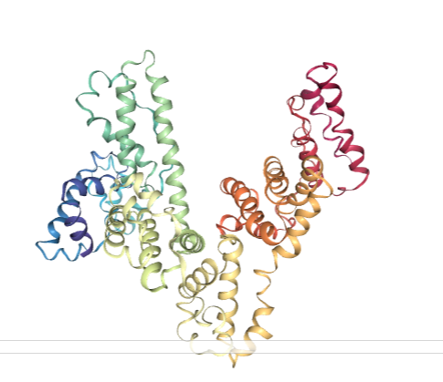
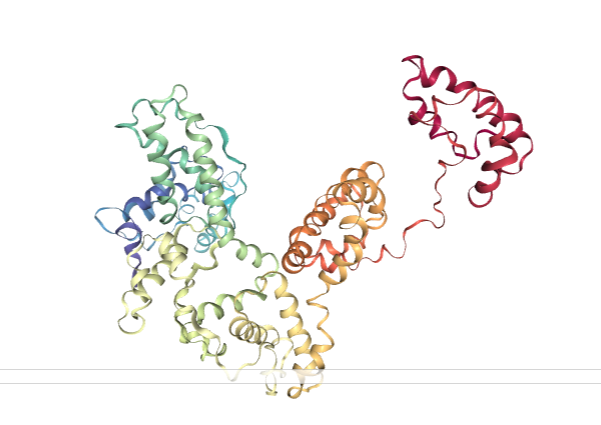

# Constant pH MD simulation

使用Amber對於某蛋白進行constant pH 條件模擬

## Input pdb

[1ao6(CRYSTAL STRUCTURE OF HUMAN SERUM ALBUMIN)](https://www.rcsb.org/structure/1AO6)


## 決定要滴定的氨基酸

因amber Constant pH MD simulation對於模擬過程中，可滴定的氨基酸數量[有限制(40個上下)](http://archive.ambermd.org/201703/0076.html)，因此使用[H++](http://biophysics.cs.vt.edu/)工具，算出各胺基酸的pH變動

### 輸入檔案:[1AO6_amber.pdb](https://github.com/allmwh/md_report/blob/master/1AO6_amber.pdb)

### 輸出檔案:[1AO6_amber.pkout](https://github.com/allmwh/md_report/blob/master/1AO6_amber.pkout)

輸出檔案為一文字檔，提供了每個胺基酸的pka變化，將此檔案丟進python處理，找出前40個變動最大的胺基酸

#### 程式碼檔案:[sort_pka_change.ipynb](https://github.com/allmwh/md_report/blob/master/sort_pka_change.ipynb)

處理結果的表格如下(僅列出部分，詳細要在程式碼裡看)，辨別出來的胺基酸，按照[amber的格式](https://ambermd.org/tutorials/advanced/tutorial18/section1.htm)，修改pdb檔案，讓amber知道要滴定這些胺基酸


修改好的pdb檔，就可以進入amber做模擬了

## pdb4amber

此為amber提供的一個小程式，可以把pdb檔案轉換成amber可以讀取的格式

具體工作是在pdb檔案中，僅保留個胺基酸的座標，其他資訊會刪除，而雙硫鍵的連結資訊也會順便加進去

```
pdb4amber -i 檔案 -o 檔案
```


## tleap

此工具可以輸入pdb檔，產出amber模擬專用的兩個檔案:

```
#tleap.in 內容

source leaprc.constph
1AO6 = loadPDB 1AO6_fixed.pdb
saveAmberParm 1AO6 1AO6.parm7 1AO6.rst7
quit
```

輸出檔為 1AO6.parm7(toplogoy file)

​				 1AO6.rst7      (coordinate file)

## cpinutil.py

在constant pH下，還需要一cpin file

```
cpinutil.py -p 1AO6.parm7 -o 1AO6.cpin
```

## 模擬

### min.mdin

最小化系統，指令如下

```
pmemd.cuda -O -i min.mdin -p 1AO6.parm7 -c 1AO6.rst7 -o 1AO6.min.mdout -r 1AO6.min.rst7 -ref 1AO6.rst7 -cpin 1AO6.cpin
```

### heat.mdin

加熱系統，指令如下

```
pmemd.cuda -O -i heat.mdin -c 1AO6.min.rst7 -p 1AO6.parm7 -ref 1AO6.min.rst7 -cpin 1AO6.cpin -o 1AO6.heat.mdout -r 1AO6.heat.rst7 -x 1AO6.heat.nc
```

### md.mdin

平衡系統，指令如下

```
pmemd.cuda -O -i md.mdin -p 1AO6.parm7 -c 1AO6.heat.rst7 -cpin 1AO6.cpin \
              -o 1AO6.equil.mdout -cpout 1AO6.equil.cpout -r 1AO6.equil.rst7 \
              -x 1AO6.equil.nc -cprestrt 1AO6.equil.cpin
```

### 不同ph模擬

指令與md.mdin相同，只改變pH和模擬時長

## 模擬結果

可以使用python搭配一些套件來看動畫，程式碼為[analysis.ipynb](https://github.com/allmwh/md_report/blob/master/analysis.ipynb)

越低的pH值下，蛋白質打開的程度越明顯，有些模擬情況到後面直接把一個subdomain丟出去了，如下圖

#### before



#### after



## 結語

amber操作上並不是非常友善，但其功能豐富，除constant pH還有許多模式可以選擇，amber官網也[放了許多教學](http://ambermd.org/tutorials/)，若在更精讀下去，對於這塊應能更了解

搭配實驗室的高速顯示卡，可以提升很多運算效能，模擬速度快很多